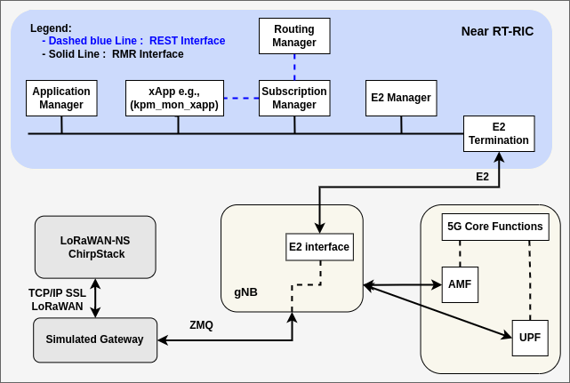

# O-LoRaWAN Prototype: README

## Overview

This repository contains a prototype implementation demonstrating the integration of LoRaWAN components into the O-RAN framework. The prototype leverages existing frameworks, including:

- **ChirpStack** as the LoRaWAN Network Server (NS)  
- **O-RAN Near-Real-Time RIC (NearRT-RIC)** with associated xApps  
- **srsRAN Project's gNodeB**  

The prototype showcases how the O-RAN ecosystem can manage LoRaWAN components by reusing the E2 interface to monitor UL and DL throughput from a LoRaWAN gateway.

---

## Prototype Architecture

The prototype adopts the legacy deployment model of O-LoRaWAN. In this model, each LoRaWAN component (gateways, network servers) connects directly to the NearRT-RIC via the E2 interface. This enables the RIC to monitor and manage these components independently.

### Prototype Implementation
The following figure illustrates the prototype setup:

  
**Figure 1:** O-LoRaWAN Prototype: NearRT-RIC and LoRaWAN Gateway Integration Employing an E2 Interface and xApps Adapted from 5G Networks.

---

## Components

### 1. **RIC Implementation**  
The RIC is based on the O-RAN Software Community (SC) RIC and includes key services:
- **e2term**: Manages E2 communications.
- **e2mgr**: Maintains connections with E2 nodes.
- **dbaas**: Provides backend data support using Redis.
- **rtmgr_sim**: Simulates routing for message delivery.
- **submgr**: Handles xApp subscriptions.
- **appmgr**: Manages xApp deployment and operations.
- **python_xapp_runner**: Supports xApp development and execution.

These modular services allow seamless integration of network functions across diverse technologies, including LoRaWAN.

### 2. **E2 Node: LoRaWAN Gateway**  
The LoRaWAN gateway acts as the E2 Node. By reusing the E2 interface from the gNB, the gateway can:
- Report specific metrics (e.g., UL and DL throughput).
- Receive and execute control commands from xApps.

The gateway connects to the NearRT-RIC, leveraging E2 communication functionality to fulfill its role as an E2 Node.

### 3. **xApp: kpm_mon_xApp**  
The **kpm_mon_xApp**, originally developed for gNB monitoring, is reused to process data from the LoRaWAN gateway. Using the **E2SM-KPM** service model, it collects UL and DL throughput metrics, demonstrating the adaptability of xApps across different network technologies.

---

## Key Highlights

- **Reusability**: The prototype reuses the E2 interface and xApps from the 5G ecosystem, minimizing development effort.
- **Flexibility**: Demonstrates how O-RAN principles can be extended to non-3GPP technologies like LoRaWAN.
- **Modularity**: Highlights the independent, modular nature of RIC components, enabling seamless integration with diverse systems.

---

## Setup Instructions

### Step 1: RIC Setup
Follow the [Setup Overview](https://docs.srsran.com/projects/project/en/latest/tutorials/source/near-rt-ric/source/index.html#setup-overview) provided by the srsRAN project to deploy the NearRT-RIC. This will result in a running RIC connected to the gNB from the srsRAN project.

### Step 2: ChirpStack NS Deployment
Run the ChirpStack Network Server (NS) to set up the LoRaWAN management framework.

### Step 3: Gateway Simulation
A simulated LoRaWAN gateway connect to the ChirpStack NS. This gateway periodically sends status messages to the NS, enabling monitoring and data collection via the RIC.

## References

- ChirpStack: [ChirpStack Documentation](https://www.chirpstack.io)  
- O-RAN SC RIC: [O-RAN SC Documentation](https://docs.o-ran-sc.org)  
- srsRAN Project: [srsRAN Documentation](https://docs.srsran.com)  
